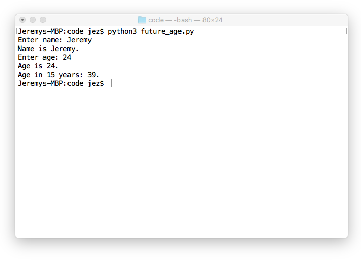

class: center, middle

# Week 02 - Types, expressions, and variables
---

## Last Week's Challenge
### `hello_global.py`
```python
print("English: Hello")
print("Japanese: Konnichiwa")
print("French: Bonjour")
print("Spanish: Hola")
print("German: Hallo")
print("Italian: Ciao")
print("Portuguese: Ola")
print("Hindi: Namaste")
print("Persian: Salaam")
print("Russian: Zdras-tvuy-te")
```
---

## Types
* All data in Python is assigned a type
* Below are some examples of common types

| Name    | Keyword   | Example   |
| ------- | --------- | --------- |
| boolean | `bool`    | `True`    |
| integer | `int`     | `1`       |
| float   | `float`   | `1.5`     |
| string  | `str`     | `'Hello'` |

* Different types have different behaviour
* Evaluate the following in the Python shell (interpreter):
    - `1+1`
    - `'1'+'1'`
    - `1+1.0`
    - `10/4`
    - `10/1`
    - `10//4`

---

### The `type()` command
* We can find the type of some data by using the `type` command.
* Evaluate the following in the Python shell:
    - `type(True)`
    - `type(False)`
    - `type('True')`
    - `type(1)`
    - `type(1.0)`
    - `type('1')`
    - `type(1+1)`
    - `type(1+1.0)`
    - `type(10/4)`
    - `type(10/1)`
    - `type(10//4)`
---

## Expressions
* An expression is something that can be evaluated
* We've already been using them!
* For example:
    - `1+1`
    - `5*5`
    - `'hello' + 'world'`
* We use expressions to combine and transform data
* Sometimes we can use different data types in the same expression
* Evaluate the following expressions in the Python shell:
    - `5*'hello'`
    - `2*'hello' + 3*'world'`
    - `'hello' + 1`
    - `'there are ' + 24*60*60 + ' seconds in a day'`
    - `1 + '1'`
---

### Type conversion
* Sometimes we want to combine two data types, but they are incompatible. For example:
    - `str` + `int`
    - `int` + `str`
* We can use type conversion to solve this problem.
* Evaluate the following expressions in the Python shell:
    - `'hello' + str(1)`
    - `'there are ' + str(24*60*60) + ' seconds in a day'`
    - `1 + int('1')`
---

## Variables
* A variable is a name that refers to a value.
* We can store the result of expression in variables, for later use.
* Evaluate the following code in the Python shell:

```python
x = 1
print(x)

x = x + 1
print(x)

x *= 2
print(x)

y = 10//3
print(y)

name = 'John'
print(name)

name *= x * y
print(name)

name += 'Smith'
print(name)

name += str(123)
print(name)
```
---

## User Input
### The `input()` command
* Often, our programs need user input
* We can get input using the `input()` command
* Evaluate the following code in the Python shell:

```python
day = input('Enter day: ')
print('Today is ' + day + '!')
```
---

## Challenge: `future_age.py`
* Write a program that asks a user for their name and age
* Your program should print both answers, and then print the users age in 15 years
* Use the `input()` command to prompt the user and store the answer in a variable
* Your program should act as follows:

---

## That's all, folks!
* You've finished the second workshop!

