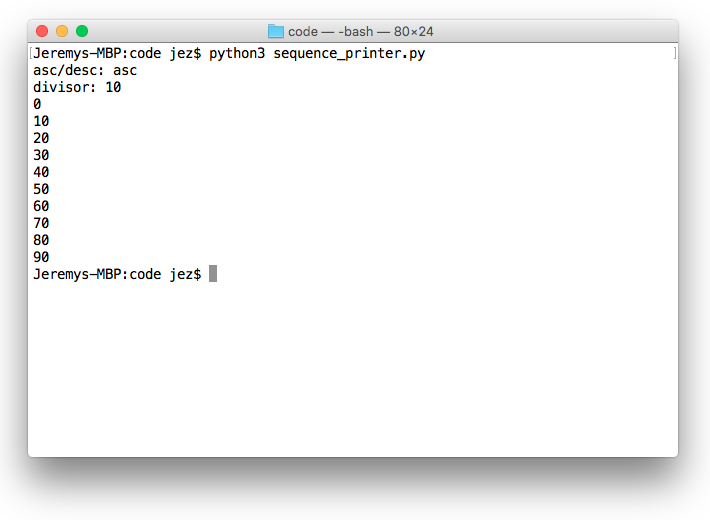

class: center, middle

# Week 03 - Conditionals and loops
---

## Last Week's Challenge
### `future_age.py`
```python
name = input('Enter name: ')
print('Name is ' + name + '.')

age = input('Enter age: ')
print('Age is ' + age + '.')

futureAge = int(age) + 15
print('Age in 15 years: ' + str(futureAge) + '.')
```
---

## Conditionals
* Conditionals allow us to control the flow of execution of a program.
* They allow us to change the behaviour of a program depending on some kind of variable, such as user input.
* For example, consider the following program:

### `drink_beer.py`
```python
print('Can you drink beer?')
age = raw_input('Enter age: ')

if (int(age) >= 18):
    print('Yes!')
else:
    print('No!')
```

---

### `if` statements
* If statements are used to execute code if a certain condition is met. 
* The condition is either a boolean, or an expression that evaluates to a boolean.
* Evaluate the following `if` statements:
    - `if (1 == 1): print("It's True!")`
    - `if (1 == 3): print("It's True!")`
    - `if (2 != 5): print("It's True!")`
    - `if (4 != 4): print("It's True!")`
    - `if (1 < 5): print("It's True!")`
    - `if (3 <= 3): print("It's True!")`
    - `if (0 > 2): print("It's True!")`
    - `if (0 >= -1): print("It's True!")`
    - `if (1 + 1 == 2): print("It's True!")`
    - `if (5*5 != 100/4): print("It's True!")`
    - `if (True): print("It's True!")`
    - `if (False): print("It's True!")`
---

### `elif` and `else`
* `elif` can be used to chain two `if` statements together.
* `else` defines the code to execute if all previous `if` and `elif` statements in the current chain evaluated to `False`.
* Look at the following example:

#### `who_am_i.py`
```python 
name = raw_input('Enter name: ')

if (name == 'Malcolm Turnbull'):
    print('Hello, Prime Minister!')
elif (name == 'Donald Trump'):
    print('Hello, President!')
elif (name == 'Queen Elizabeth II'):
    print('Hello, Queen!')
else:
    print('Hello, citizen!')
```
---

### `while` loops
* While loops are used to continuously execute code while a certain condition is met.
* This is useful when we want to repeat a block of code.
* For example:

#### `ten_to_zero.py`
```python
x = 0
while (x < 10):
    print(x)
    x += 1      # same as x = x + 1
```

#### `secret.py`
```python
word = 'None'
while (word != 'secret'):
    word = raw_input('Guess the word: ')

print('Congratulations!')
```
---

### `for` loops
* For loops are used to execute code one time for every item in some kind of collection (such as a range of numbers between 0 and 100).
* For example:

#### `divisible_by_3.py`
```python
for i in range(100):
    if (i % 3 == 0):
        print(i)
```

#### `list_iterator.py`
```python
for s in ['this','is','a','list']:
    if ('i' in s):
        print(s)
```
---

## Challenge: `sequence_printer.py`
Write a program that behaves as follows:
* The program prompts the user to type "asc" (ascending) or "desc" (descending).
* The program prompts the user to type a divisor.
* The program prints the numbers between 0 and 100 that are perfectly divisible by the divisor.
* If the user initially typed "asc", the numbers are printed in ascending order. Otherwise, the numbers are printed in descending order.

---
### Example input / output

---

## That's all, folks!
* You've finished the third workshop!